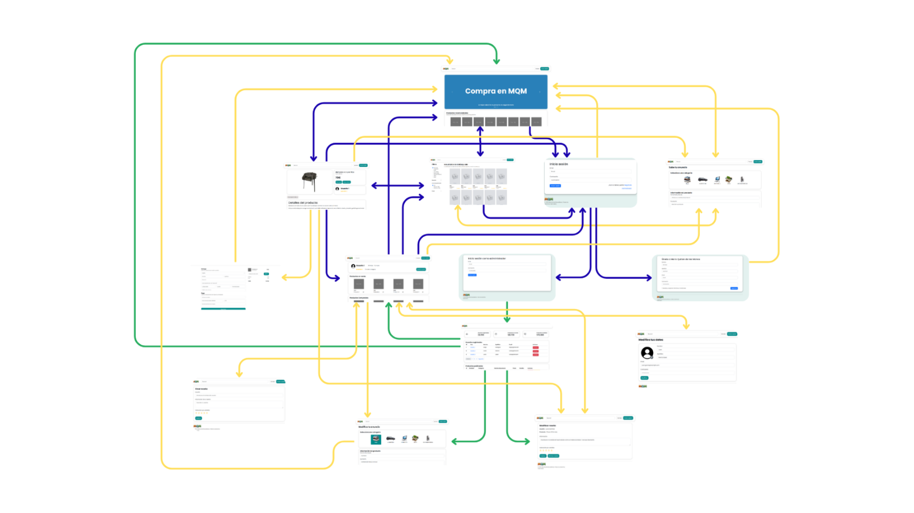

# MeLoQuitanDeLasManos (MQM)

## 👥 Group members
| Name and surname | URJC Email | GitHub User |
|:--- |:--- |:--- |
| Lucas Moreno Prieto | l.morenop.2023@alumnos.urjc.es | lucasmp31 |
| Diego Rodríguez Torrecilla | d.rodriguezto.2023@alumnos.urjc.es | DiegoRodriguezT |
| Lucia López García del Pino| l.lopezgar.2023@alumnos.urjc.es | lucialopezgp |

---

## 🎭 **Preparation: Project Definition**

### **Topic Description**
A web application intended for buying/selling second hand products, similar to Wallapop, that allows users to search products or offer them for sale, as well as letting them buy and give reviews to their sellers. If an user is interested in buying a product, the app lets them communicate with the vendor through a chat. This application gives the user the capability of getting money easily selling objects they don't use anymore and buying other ones at a cheap price. 

### **Entities**
1. **User**: represents buyers and sellers (same role). It stores name, email address, phone number, avatar and delivery address.  
2. **Product**: an item offered for sale by a vendor, ready for another user to buy it. A product includes information such as title, description, images and list of categories. 
3. **Order**: a purchase of a single product by a user. Includes product, buyer, purchase date and estimated time of arrival. 
4. **Message** (optional): represents a message in a chat between two users, at a specific time. Stores the message text, sender, receptor and timestamp.
5. **Review**: user feedback after a purchase. Includes text and number of stars given from 1 to 5, as well as reviewed and reviewer users. 

**Connections between entities:**
- User - Order: a user can make several orders (1:N)
- User - Message: a user can message multiple users and send multiple messages. Each message has one transmitter and one receptor. (1:N)
- User - Review: a user can make multiple reviews about multiple users. Each message has one writer and is about another user in particular (1:N)
- Order - Product: each order has exactly one product, because they can buy from different users (1:1) 

### **User Permissions**

* **Anonymous User**: 
  - Permissions: viewing products available in the website, searching and signing up to access the rest of features. 
  - Not owner of any entity. 

* **Registered User**: 
  - Permissions: putting up products for sale, buying products, message other users, reviewing vendors.
  - Owner of: their products, their messages to other users, and the reviews they make, as well as personal information.

* **Administrator**: 
  - Permissions: modify or delete products, users or reviews not following the Terms and Conditions, looking at internal statistics.
  - Able to manage everything in the website, including users, products, orders, categories and reviews. 

### **Images**

- **User**: each user has one image as their avatar.
- **Product**: each product has different images of the product taken by the vendor.
- **Review** (optional): a review may have images showing the product as it arrived to the customer.

### **Charts**

- **Reviews**: Bar chart showing the reviews given to a user
- **Top Categories**: Pie chart showing categories where users buy the most
- **Registered Users**: Line chart of registered users by month.
- **Daily Purchases**: Bar chart showing purchases made by day.

### **Complementary Technology**

- Automatic emails: users will receive automatic emails notifying them of new messages or if someone buys one of their products.
- Generation of PDF invoices. 

### **Algorithm or Advanced query**

- **Algorithm/Query**: Search algorithm showing products in order of the vendor's reviews and also taking into account the distance.
- **Description**: It searches the database of products and shows the ones with matches in name to the search, ordered by ratings (from higher to lower) and distance (from lower to higher). 
- **Alternative**: more complex recommendations to user, depending on what type of items they have bought previously (category, vendor, etc.).

---

## 🛠 **Práctica 1: Maquetación de páginas web con HTML y CSS**

### **Diagrama de Navegación**
Diagrama que muestra cómo se navega entre las diferentes páginas de la aplicación:



> [Descripción opcional del flujo de navegación: Ej: "El usuario puede acceder desde la página principal a todas las secciones mediante el menú de navegación. Los usuarios anónimos solo tienen acceso a las páginas públicas, mientras que los registrados pueden acceder a su perfil y panel de usuario."]

### **Capturas de Pantalla y Descripción de Páginas**

#### **1. Página Principal / Home**


> [Descripción breve: Ej: "Página de inicio que muestra los productos destacados, categorías principales y un banner promocional. Incluye barra de navegación y acceso a registro/login para usuarios no autenticados."]

#### **AQUÍ AÑADIR EL RESTO DE PÁGINAS**

### **Members Participation in Assignment 1**

#### **Student 1 - Diego Rodríguez Torrecilla**

Design and development of some of the main pages of the application. Created the landing page (index.html) with search bar, carousel, recommended products and categories. Built the search results page (search.html) with product listings and filtering options. Developed the purchase page (buy.html) including order summary, delivery address, and payment forms. Implemented header and footer shared by all the pages of the application, as well as some common styling in styles.css. Implemented responsive navigation with Bootstrap offcanvas & collapse menus.

| Nº    | Commits      | Files      |
|:------------: |:------------:| :------------:|
|1| [Create buy.html page with order summary and delivery and payment forms. Add responsive navigation with offcanvas bootstrap menu. Update button styles.](https://github.com/CodeURJC-SSDD-2025-26/practica-ssdd-2025-26-grupo-13/commit/3261f19efe4fe63d7acaecf56ffc4660f8c6309a)  | [Archivo1](URL_archivo_1)   |
|2| [Implement search.html with list of products and filter options. Change styles to improve responsiveness and consistency. Add links to product.html in each product card.](https://github.com/CodeURJC-SSDD-2025-26/practica-ssdd-2025-26-grupo-13/commit/a9fac4ec4971ce9a3ca505fd11887b9742a2ba0a)  | [Archivo2](URL_archivo_2)   |
|3| [Add index.html, including search bar, carousel, recommended products and base CSS.](https://github.com/CodeURJC-SSDD-2025-26/practica-ssdd-2025-26-grupo-13/commit/3ddd48dd81aa02f5286d6ed3193a9129df6ba0ff#diff-0eb547304658805aad788d320f10bf1f292797b5e6d745a3bf617584da017051)  | [Archivo3](URL_archivo_3)   |
|4| [Add categories section to index.html, update CSS for improved layout, and create new search.html and search.css files for search results functionality.](https://github.com/CodeURJC-SSDD-2025-26/practica-ssdd-2025-26-grupo-13/commit/18ea3ab9cb95f721d20be5b24ef9e7f3bc310b7e#diff-8802dce05666bd3b9a6e2d0859f727e2a85d317bd900e3f71fb359bc219caf2a)  | [Archivo4](URL_archivo_4)   |
|5| [Moved common styles to styles.css — established shared styling architecture used across all pages.](https://github.com/CodeURJC-SSDD-2025-26/practica-ssdd-2025-26-grupo-13/commit/880803ee7fb11143eb11812d512f57efa92c14cd)  | [Archivo5](URL_archivo_5)   |

---

#### **Student 2 - Lucía López García del Pino**

Making the login and register pages, ensuring that all fields must be completed before submitting the form and unifying their styles into one CSS file; creating the page user_profile, that shows information about a certain user like products bought or sold and reviews made about them; creating the sell_product and modify_product pages, that enable a user to upload an advertisement of their product in the web, ensuring that all fields are completed; making the administrator dashboard, a page only visible to administrators that shows various charts and lists of users, products and reviews uploaded to the web.

| Nº    | Commits      | Files      |
|:------------: |:------------:| :------------:|
|1| [Created entire user profile page with dedicated CSS styling and profile images](https://github.com/CodeURJC-SSDD-2025-26/practica-ssdd-2025-26-grupo-13/commit/3cf3c8314108253a9896e6b1b0f39227e3bdd4d2)  | [user_profile.html](https://github.com/CodeURJC-SSDD-2025-26/practica-ssdd-2025-26-grupo-13/blob/74671e8605b26a62ba15eca4b9c03a3b778ed6c0/user_profile.html)   |
|2| [Implemented seller's product upload form with styling](https://github.com/CodeURJC-SSDD-2025-26/practica-ssdd-2025-26-grupo-13/commit/ec438b3ab402df4813ccf606c86916bacec1d5e1)  | [sell_product.html](https://github.com/CodeURJC-SSDD-2025-26/practica-ssdd-2025-26-grupo-13/blob/main/sell_product.html)   |
|3| [Built entire administrator dashboard with form validation logic and administrator](https://github.com/CodeURJC-SSDD-2025-26/practica-ssdd-2025-26-grupo-13/commit/077e56be26e1ee878f93b61ff059ea02574dcc3f)  | [administrator_dashboard.html](https://github.com/CodeURJC-SSDD-2025-26/practica-ssdd-2025-26-grupo-13/blob/main/administrator_dashboard.html)   |
|4| [Created product editing functionality for vendors - enables product management](https://github.com/CodeURJC-SSDD-2025-26/practica-ssdd-2025-26-grupo-13/commit/6b3a8789cae347e096776bac2253e9e6167cb1a3)  | [modify_product.html](https://github.com/CodeURJC-SSDD-2025-26/practica-ssdd-2025-26-grupo-13/blob/main/modify_product.html)   |
|5| [Established core authentication system and navigation flow](https://github.com/CodeURJC-SSDD-2025-26/practica-ssdd-2025-26-grupo-13/commit/cf36400095be133324b2dc751c957e5dc6b8cd5a)  | [login.html](https://github.com/CodeURJC-SSDD-2025-26/practica-ssdd-2025-26-grupo-13/blob/main/login.html)   |

---

#### **Student 3 - [Nombre Completo]**

[Descripción de las tareas y responsabilidades principales del alumno en el proyecto]

| Nº    | Commits      | Files      |
|:------------: |:------------:| :------------:|
|1| [Descripción commit 1](URL_commit_1)  | [Archivo1](URL_archivo_1)   |
|2| [Descripción commit 2](URL_commit_2)  | [Archivo2](URL_archivo_2)   |
|3| [Descripción commit 3](URL_commit_3)  | [Archivo3](URL_archivo_3)   |
|4| [Descripción commit 4](URL_commit_4)  | [Archivo4](URL_archivo_4)   |
|5| [Descripción commit 5](URL_commit_5)  | [Archivo5](URL_archivo_5)   |

---

#### **Alumno 4 - [Nombre Completo]**

[Descripción de las tareas y responsabilidades principales del alumno en el proyecto]

| Nº    | Commits      | Files      |
|:------------: |:------------:| :------------:|
|1| [Descripción commit 1](URL_commit_1)  | [Archivo1](URL_archivo_1)   |
|2| [Descripción commit 2](URL_commit_2)  | [Archivo2](URL_archivo_2)   |
|3| [Descripción commit 3](URL_commit_3)  | [Archivo3](URL_archivo_3)   |
|4| [Descripción commit 4](URL_commit_4)  | [Archivo4](URL_archivo_4)   |
|5| [Descripción commit 5](URL_commit_5)  | [Archivo5](URL_archivo_5)   |

---

## 🛠 **Práctica 2: Web con HTML generado en servidor**

### **Navegación y Capturas de Pantalla**

#### **Diagrama de Navegación**

Solo si ha cambiado.

#### **Capturas de Pantalla Actualizadas**

Solo si han cambiado.

### **Instrucciones de Ejecución**

#### **Requisitos Previos**
- **Java**: versión 21 o superior
- **Maven**: versión 3.8 o superior
- **MySQL**: versión 8.0 o superior
- **Git**: para clonar el repositorio

#### **Pasos para ejecutar la aplicación**

1. **Clonar el repositorio**
   ```bash
   git clone https://github.com/[usuario]/[nombre-repositorio].git
   cd [nombre-repositorio]
   ```

2. **AQUÍ INDICAR LO SIGUIENTES PASOS**

#### **Credenciales de prueba**
- **Usuario Admin**: usuario: `admin`, contraseña: `admin`
- **Usuario Registrado**: usuario: `user`, contraseña: `user`

### **Diagrama de Entidades de Base de Datos**

Diagrama mostrando las entidades, sus campos y relaciones:


> [Descripción opcional: Ej: "El diagrama muestra las 4 entidades principales: Usuario, Producto, Pedido y Categoría, con sus respectivos atributos y relaciones 1:N y N:M."]

### **Diagrama de Clases y Templates**

Diagrama de clases de la aplicación con diferenciación por colores o secciones:


> [Descripción opcional del diagrama y relaciones principales]

### **Participación de Miembros en la Práctica 2**

#### **Alumno 1 - [Nombre Completo]**

[Descripción de las tareas y responsabilidades principales del alumno en el proyecto]

| Nº    | Commits      | Files      |
|:------------: |:------------:| :------------:|
|1| [Descripción commit 1](URL_commit_1)  | [Archivo1](URL_archivo_1)   |
|2| [Descripción commit 2](URL_commit_2)  | [Archivo2](URL_archivo_2)   |
|3| [Descripción commit 3](URL_commit_3)  | [Archivo3](URL_archivo_3)   |
|4| [Descripción commit 4](URL_commit_4)  | [Archivo4](URL_archivo_4)   |
|5| [Descripción commit 5](URL_commit_5)  | [Archivo5](URL_archivo_5)   |

---

#### **Alumno 2 - [Nombre Completo]**

[Descripción de las tareas y responsabilidades principales del alumno en el proyecto]

| Nº    | Commits      | Files      |
|:------------: |:------------:| :------------:|
|1| [Descripción commit 1](URL_commit_1)  | [Archivo1](URL_archivo_1)   |
|2| [Descripción commit 2](URL_commit_2)  | [Archivo2](URL_archivo_2)   |
|3| [Descripción commit 3](URL_commit_3)  | [Archivo3](URL_archivo_3)   |
|4| [Descripción commit 4](URL_commit_4)  | [Archivo4](URL_archivo_4)   |
|5| [Descripción commit 5](URL_commit_5)  | [Archivo5](URL_archivo_5)   |

---

#### **Alumno 3 - [Nombre Completo]**

[Descripción de las tareas y responsabilidades principales del alumno en el proyecto]

| Nº    | Commits      | Files      |
|:------------: |:------------:| :------------:|
|1| [Descripción commit 1](URL_commit_1)  | [Archivo1](URL_archivo_1)   |
|2| [Descripción commit 2](URL_commit_2)  | [Archivo2](URL_archivo_2)   |
|3| [Descripción commit 3](URL_commit_3)  | [Archivo3](URL_archivo_3)   |
|4| [Descripción commit 4](URL_commit_4)  | [Archivo4](URL_archivo_4)   |
|5| [Descripción commit 5](URL_commit_5)  | [Archivo5](URL_archivo_5)   |

---

#### **Alumno 4 - [Nombre Completo]**

[Descripción de las tareas y responsabilidades principales del alumno en el proyecto]

| Nº    | Commits      | Files      |
|:------------: |:------------:| :------------:|
|1| [Descripción commit 1](URL_commit_1)  | [Archivo1](URL_archivo_1)   |
|2| [Descripción commit 2](URL_commit_2)  | [Archivo2](URL_archivo_2)   |
|3| [Descripción commit 3](URL_commit_3)  | [Archivo3](URL_archivo_3)   |
|4| [Descripción commit 4](URL_commit_4)  | [Archivo4](URL_archivo_4)   |
|5| [Descripción commit 5](URL_commit_5)  | [Archivo5](URL_archivo_5)   |

---

## 🛠 **Práctica 3: API REST, docker y despliegue**

### **Documentación de la API REST**

#### **Especificación OpenAPI**
📄 **[Especificación OpenAPI (YAML)](/api-docs/api-docs.yaml)**

#### **Documentación HTML**
📖 **[Documentación API REST (HTML)](https://raw.githack.com/[usuario]/[repositorio]/main/api-docs/api-docs.html)**

> La documentación de la API REST se encuentra en la carpeta `/api-docs` del repositorio. Se ha generado automáticamente con SpringDoc a partir de las anotaciones en el código Java.

### **Diagrama de Clases y Templates Actualizado**

Diagrama actualizado incluyendo los @RestController y su relación con los @Service compartidos:


### **Instrucciones de Ejecución con Docker**

#### **Requisitos previos:**
- Docker instalado (versión 20.10 o superior)
- Docker Compose instalado (versión 2.0 o superior)

#### **Pasos para ejecutar con docker-compose:**

1. **Clonar el repositorio** (si no lo has hecho ya):
   ```bash
   git clone https://github.com/[usuario]/[repositorio].git
   cd [repositorio]
   ```

2. **AQUÍ LOS SIGUIENTES PASOS**:

### **Construcción de la Imagen Docker**

#### **Requisitos:**
- Docker instalado en el sistema

#### **Pasos para construir y publicar la imagen:**

1. **Navegar al directorio de Docker**:
   ```bash
   cd docker
   ```

2. **AQUÍ LOS SIGUIENTES PASOS**

### **Despliegue en Máquina Virtual**

#### **Requisitos:**
- Acceso a la máquina virtual (SSH)
- Clave privada para autenticación
- Conexión a la red correspondiente o VPN configurada

#### **Pasos para desplegar:**

1. **Conectar a la máquina virtual**:
   ```bash
   ssh -i [ruta/a/clave.key] [usuario]@[IP-o-dominio-VM]
   ```
   
   Ejemplo:
   ```bash
   ssh -i ssh-keys/app.key vmuser@10.100.139.XXX
   ```

2. **AQUÍ LOS SIGUIENTES PASOS**:

### **URL de la Aplicación Desplegada**

🌐 **URL de acceso**: `https://[nombre-app].etsii.urjc.es:8443`

#### **Credenciales de Usuarios de Ejemplo**

| Rol | Usuario | Contraseña |
|:---|:---|:---|
| Administrador | admin | admin123 |
| Usuario Registrado | user1 | user123 |
| Usuario Registrado | user2 | user123 |

### **OTRA DOCUMENTACIÓN ADICIONAL REQUERIDA EN LA PRÁCTICA**

### **Participación de Miembros en la Práctica 3**

#### **Alumno 1 - [Nombre Completo]**

[Descripción de las tareas y responsabilidades principales del alumno en el proyecto]

| Nº    | Commits      | Files      |
|:------------: |:------------:| :------------:|
|1| [Descripción commit 1](URL_commit_1)  | [Archivo1](URL_archivo_1)   |
|2| [Descripción commit 2](URL_commit_2)  | [Archivo2](URL_archivo_2)   |
|3| [Descripción commit 3](URL_commit_3)  | [Archivo3](URL_archivo_3)   |
|4| [Descripción commit 4](URL_commit_4)  | [Archivo4](URL_archivo_4)   |
|5| [Descripción commit 5](URL_commit_5)  | [Archivo5](URL_archivo_5)   |

---

#### **Alumno 2 - [Nombre Completo]**

[Descripción de las tareas y responsabilidades principales del alumno en el proyecto]

| Nº    | Commits      | Files      |
|:------------: |:------------:| :------------:|
|1| [Descripción commit 1](URL_commit_1)  | [Archivo1](URL_archivo_1)   |
|2| [Descripción commit 2](URL_commit_2)  | [Archivo2](URL_archivo_2)   |
|3| [Descripción commit 3](URL_commit_3)  | [Archivo3](URL_archivo_3)   |
|4| [Descripción commit 4](URL_commit_4)  | [Archivo4](URL_archivo_4)   |
|5| [Descripción commit 5](URL_commit_5)  | [Archivo5](URL_archivo_5)   |

---

#### **Alumno 3 - [Nombre Completo]**

[Descripción de las tareas y responsabilidades principales del alumno en el proyecto]

| Nº    | Commits      | Files      |
|:------------: |:------------:| :------------:|
|1| [Descripción commit 1](URL_commit_1)  | [Archivo1](URL_archivo_1)   |
|2| [Descripción commit 2](URL_commit_2)  | [Archivo2](URL_archivo_2)   |
|3| [Descripción commit 3](URL_commit_3)  | [Archivo3](URL_archivo_3)   |
|4| [Descripción commit 4](URL_commit_4)  | [Archivo4](URL_archivo_4)   |
|5| [Descripción commit 5](URL_commit_5)  | [Archivo5](URL_archivo_5)   |

---

#### **Alumno 4 - [Nombre Completo]**

[Descripción de las tareas y responsabilidades principales del alumno en el proyecto]

| Nº    | Commits      | Files      |
|:------------: |:------------:| :------------:|
|1| [Descripción commit 1](URL_commit_1)  | [Archivo1](URL_archivo_1)   |
|2| [Descripción commit 2](URL_commit_2)  | [Archivo2](URL_archivo_2)   |
|3| [Descripción commit 3](URL_commit_3)  | [Archivo3](URL_archivo_3)   |
|4| [Descripción commit 4](URL_commit_4)  | [Archivo4](URL_archivo_4)   |
|5| [Descripción commit 5](URL_commit_5)  | [Archivo5](URL_archivo_5)   |

---
