# MeLoQuitanDeLasManos (MQM)

## 👥 Group members

| Name and surname            | URJC Email                         | GitHub User     |
| :-------------------------- | :--------------------------------- | :-------------- |
| Lucas Moreno Prieto         | l.morenop.2023@alumnos.urjc.es     | lucasmp31       |
| Diego Rodríguez Torrecilla  | d.rodriguezto.2023@alumnos.urjc.es | DiegoRodriguezT |
| Lucia López García del Pino | l.lopezgar.2023@alumnos.urjc.es    | lucialopezgp    |

---

## 🎭 **Preparation: Project Definition**

### **Topic Description**

A web application intended for buying/selling second hand products, similar to Wallapop, that allows users to search products or offer them for sale, as well as letting them buy and give reviews to their sellers. If an user is interested in buying a product, the app lets them communicate with the vendor through a chat. This application gives the user the capability of getting money easily selling objects they don't use anymore and buying other ones at a cheap price.

### **Entities**

1. **User**: represents buyers and sellers (same role). It stores name, email address, phone number, avatar and delivery address.
2. **Product**: an item offered for sale by a vendor, ready for another user to buy it. A product includes information such as title, description, images and list of categories.
3. **Order**: a purchase of a single product by a user. Includes product, buyer, purchase date, estimated time of arrival and destination address.
4. **Review**: user feedback after a purchase. Includes text and number of stars given from 1 to 5, as well as reviewed and reviewer users.

**Connections between entities:**

- User - Order: a user can make several orders (1:N)
- User - Review: a user can make multiple reviews about multiple users. Each message has one writer and is about another user in particular (1:N)
- Order - Product: each order has exactly one product, because they can buy from different users (1:1)

### **User Permissions**

- **Anonymous User**:
  - Permissions: viewing products available in the website, searching and signing up to access the rest of features.
  - Not owner of any entity.

- **Registered User**:
  - Permissions: putting up products for sale, buying products, message other users, reviewing vendors.
  - Owner of: their products, their messages to other users, and the reviews they make, as well as personal information.

- **Administrator**:
  - Permissions: modify or delete products, users or reviews not following the Terms and Conditions, looking at internal statistics.
  - Able to manage everything in the website, including users, products, orders, categories and reviews.

### **Images**

- **User**: each user has one image as their avatar.
- **Product**: each product has different images of the product taken by the vendor.
- **Review** (optional): a review may have images showing the product as it arrived to the customer.

### **Charts**

- **Reviews**: Bar chart showing the reviews given to a user
- **Top Categories**: Pie chart showing categories where users buy the most
- **Registered Users**: Line chart of registered users by month.
- **Daily Purchases**: Bar chart showing purchases made by day.

### **Complementary Technology**

- Automatic emails: users will receive automatic emails notifying them of new messages or if someone buys one of their products.
- Generation of PDF invoices.

### **Algorithm or Advanced query**

- **Algorithm/Query**: Search algorithm showing products in order of the vendor's reviews and also taking into account the distance.
- **Description**: It searches the database of products and shows the ones with matches in name to the search, ordered by ratings (from higher to lower) and distance (from lower to higher).
- **Alternative**: more complex recommendations to user, depending on what type of items they have bought previously (category, vendor, etc.).

---

## 🛠 **Assignment 1: Webpage layout with HTML and CSS**

### **Navigation Diagram**

Diagram that shows how to navigate between the different pages of the application:

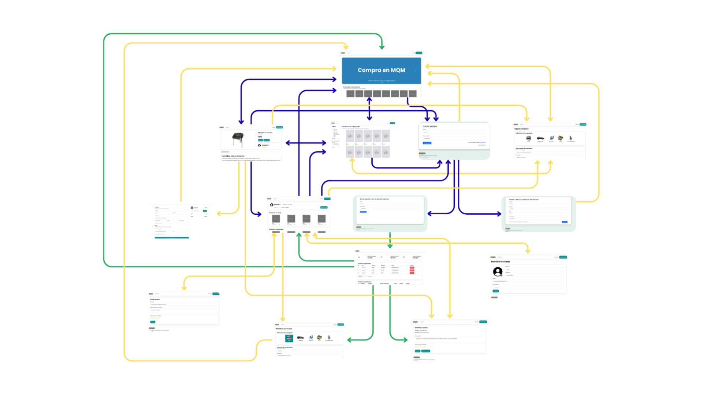

> The blue arrows represent actions that all users can make, the yellow arrows are only for registered users and the green arrows are for administrators.
> In the modify_user, modify_review and create_review pages the search bar and sell button are shown, but in reality they would be hidden, that is why there aren't any arrows to the sell and search pages.
> Also, in all the pages only accesible to registered users the log in button still apears, but it would be hidden with code.

### **Screenshots and Descriptions of Pages**

#### **1. Home Page**

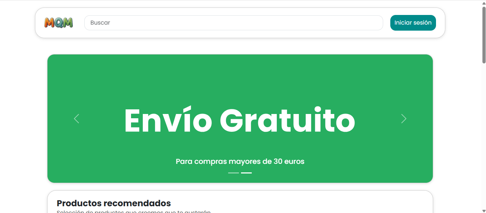

> Home page of the web app, showing a search bar, carousel and sections listing recommended products and categories.

#### **2. Login Page**

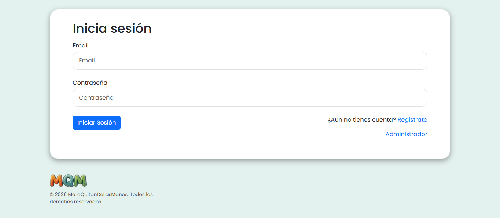

> It consists of a form that asks for the email, password and a login button. Plus, there are links to the register pages and administrator login.

#### **3. Register Page**

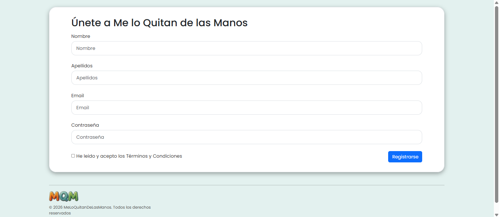

> It consists of a form that asks for the email, name, surnames and password, as well as a register button.

#### **4. User Profile Page**

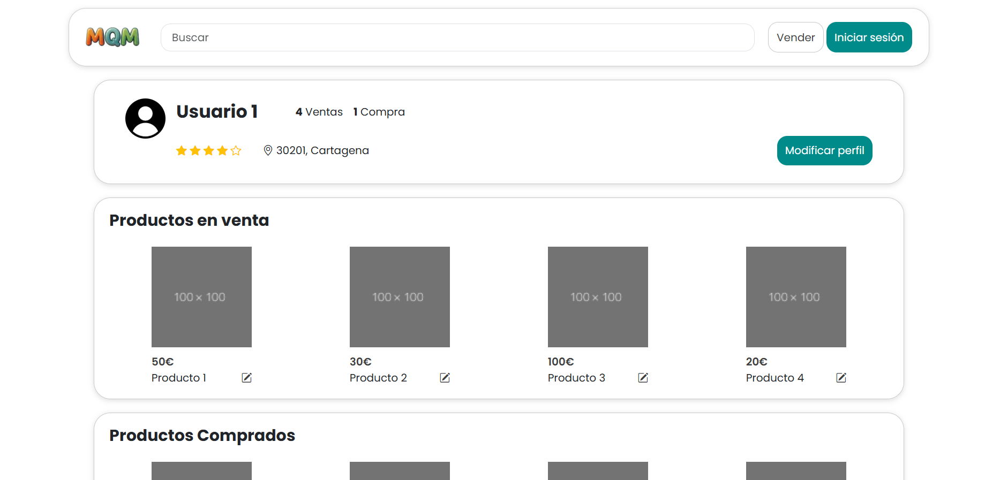

> It shows the basic user's information (photo, username, ratings,...), in addition to the list of products sold and bought and the reviews made about them.

#### **5. Sell Product Page**

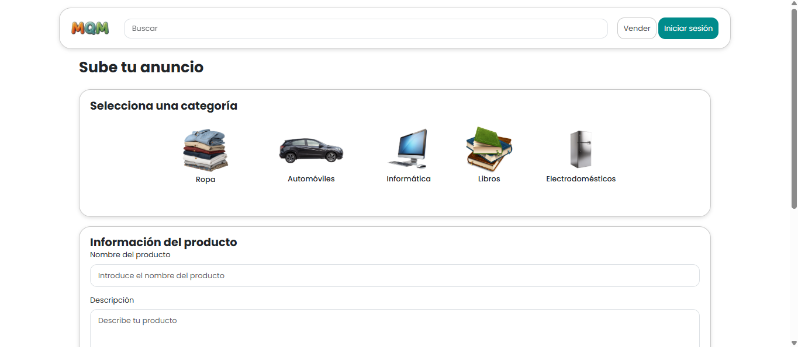

> It enables the user to upload an advertisement of a product. It consists of a form that collects the necessary data, like the category, description, price and an image to show the product, as well as the upload button.

#### **6. Modify Product Page**

> 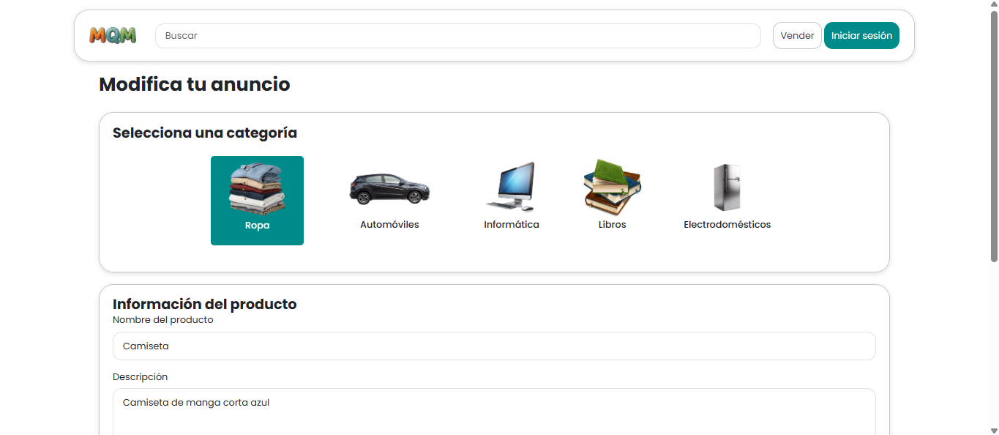
> It makes possible modifying your product's advertisement. It consists of the same form as the Sell Product Page with the initial data, where you can change any of the information. There is also an upload button.

#### **7. Search Page**

> 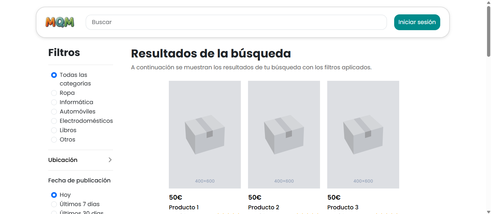
> The user is taken here when searching something through the search bar, located in the header of (almost) all webpages. A list of product results matching the input of the user is shown, with options to filter by category, location, publication date and minimum & maximum price.

#### **8. Buy Page**

> 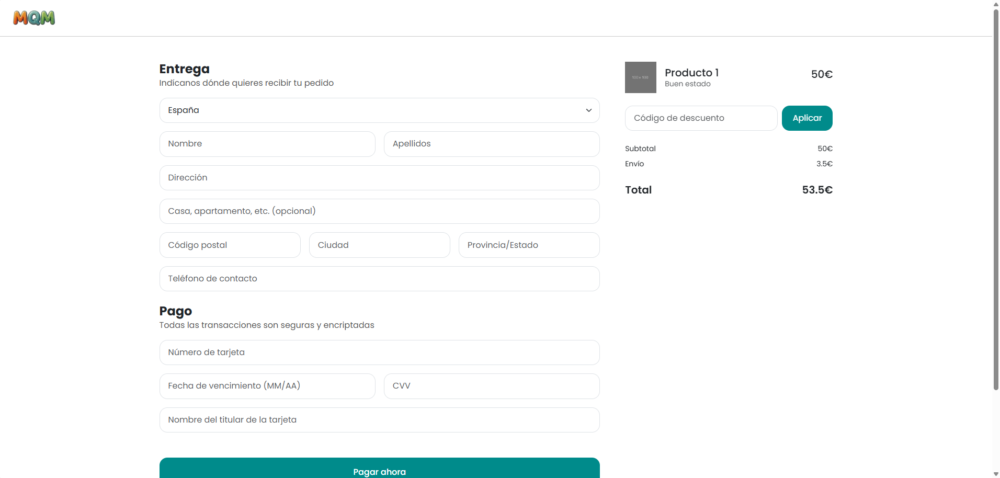
> This website requests the user's shipping and payment details necessary to purchase the product. The required shipping information includes the name, street address, city, postal code, etc. For payment, the user must provide credit card details such as the card number and CVV. On the right, a summary of the product and its price is shown, letting users apply a discount code if available.

#### **9. Administrator Dashboard Page**

> 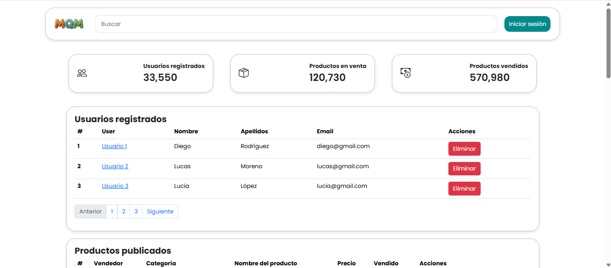
> It enables the administrator to see certain stadistics and charts about the users, reviews and products that conform the web, in addition to the complete lists of users, reviews and products, being able to change or delete them.

#### **10. Administrator Login Page**

> 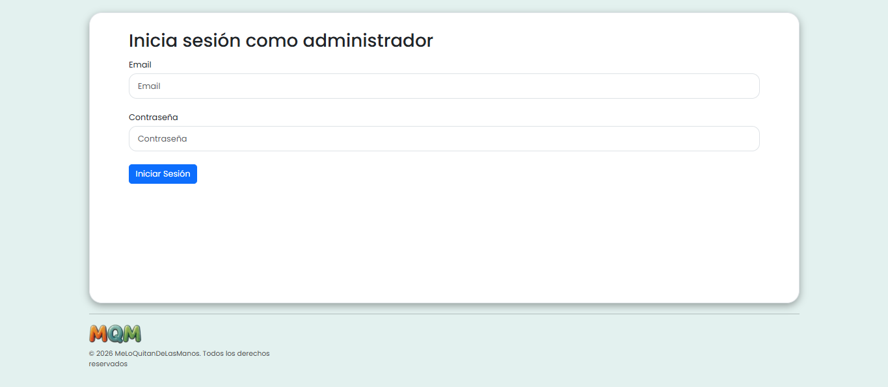
> It consists of a form that asks for the email and password of an administrator so that the administrator can access their unique functions.

#### **11. Create Review Page**

> 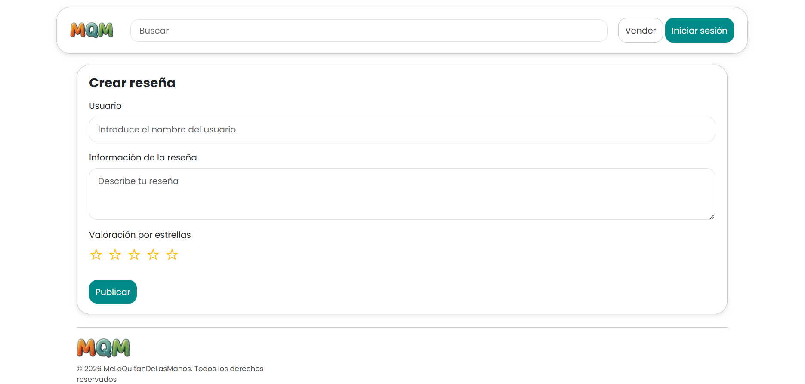
> It displays a form for entering the information needed to write a review. There is also a star rating system.

#### **12. Modify Review Page**

> 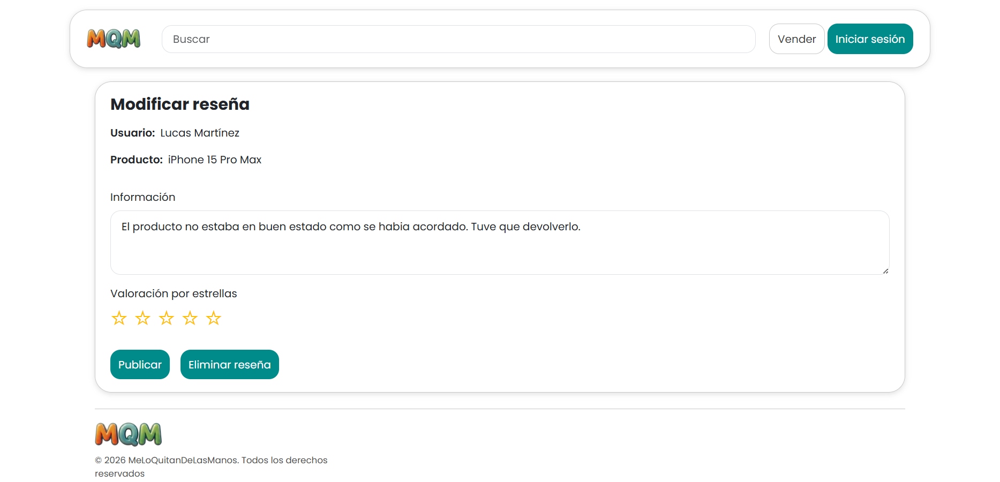
> It shows the user and the product that has been reviewed and allows you to modify the description and the star rating.

#### **13. Modify User Page**

> 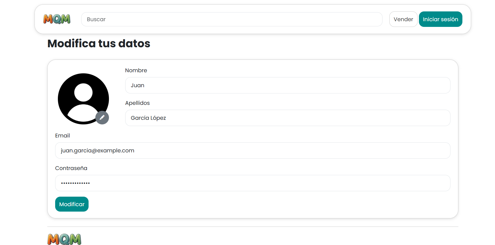
> It allows you to view your current user data and change it. You can also change your profile picture.

#### **14. Product Page**

> 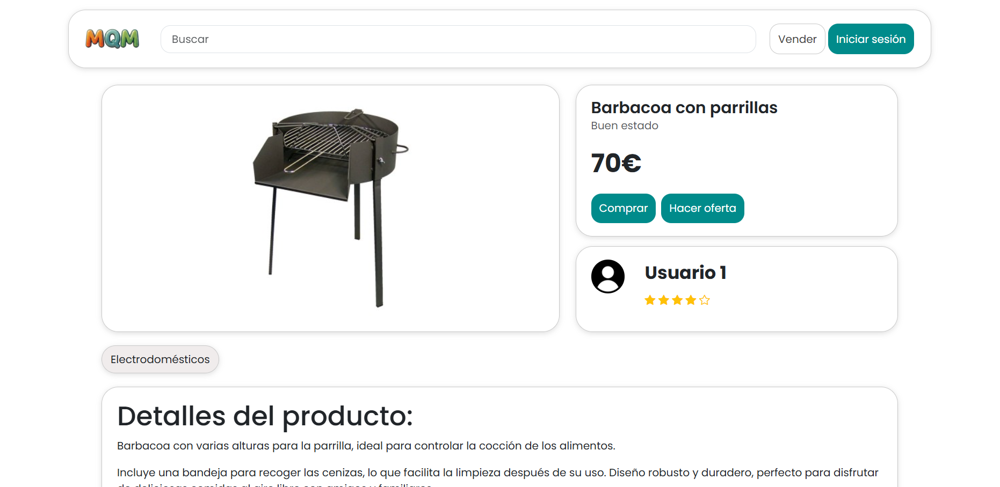
> It consists of a page for each product listed for sale. It displays the product's main features, price, and the seller. It also provides information about the seller, such as their star rating, name, location, and some of the most important reviews left by other users.

### **Members Participation in Assignment 1**

#### **Student 1 - Diego Rodríguez Torrecilla**

Design and development of some of the main pages of the application. Created the landing page (index.html) with search bar, carousel, recommended products and categories. Built the search results page (search.html) with product listings and filtering by category, location, date and price. Developed the purchase page (buy.html) including order summary, delivery address, and payment forms. Implemented header and footer shared by all the pages of the application, as well as some common styling in styles.css. Implemented responsive navigation with Bootstrap offcanvas & collapse menus. Ensured uniform class naming and styling consistency across all developed pages. Created the product card component reused across multiple pages (index, search, user profile) for consistency.

| Nº  |                                                                                                                                                                         Commits                                                                                                                                                                          |                                                                                                                                                                                                                          Files                                                                                                                                                                                                                          |
| :-: | :------------------------------------------------------------------------------------------------------------------------------------------------------------------------------------------------------------------------------------------------------------------------------------------------------------------------------------------------------: | :-----------------------------------------------------------------------------------------------------------------------------------------------------------------------------------------------------------------------------------------------------------------------------------------------------------------------------------------------------------------------------------------------------------------------------------------------------: |
|  1  |                                    [Create buy.html page with order summary and delivery and payment forms. Add responsive navigation with offcanvas bootstrap menu. Update button styles.](https://github.com/CodeURJC-SSDD-2025-26/practica-ssdd-2025-26-grupo-13/commit/3261f19efe4fe63d7acaecf56ffc4660f8c6309a)                                     |                                                             Mostly [buy.html](https://github.com/CodeURJC-SSDD-2025-26/practica-ssdd-2025-26-grupo-13/blob/main/buy.html), [buy.css](https://github.com/CodeURJC-SSDD-2025-26/practica-ssdd-2025-26-grupo-13/blob/main/buy.css), [styles.css](https://github.com/CodeURJC-SSDD-2025-26/practica-ssdd-2025-26-grupo-13/blob/main/styles.css)                                                             |
|  2  |                           [Implement search.html with list of products and filter options. Change styles to improve responsiveness and consistency. Add links to product.html in each product card.](https://github.com/CodeURJC-SSDD-2025-26/practica-ssdd-2025-26-grupo-13/commit/a9fac4ec4971ce9a3ca505fd11887b9742a2ba0a)                            | Mostly [search.html](https://github.com/CodeURJC-SSDD-2025-26/practica-ssdd-2025-26-grupo-13/blob/main/search.html), [search.css](https://github.com/CodeURJC-SSDD-2025-26/practica-ssdd-2025-26-grupo-13/blob/main/search.css), [index.html](https://github.com/CodeURJC-SSDD-2025-26/practica-ssdd-2025-26-grupo-13/blob/main/index.html), [styles.css](https://github.com/CodeURJC-SSDD-2025-26/practica-ssdd-2025-26-grupo-13/blob/main/styles.css) |
|  3  |                                   [Add index.html, including search bar, carousel, recommended products and base CSS.](https://github.com/CodeURJC-SSDD-2025-26/practica-ssdd-2025-26-grupo-13/commit/3ddd48dd81aa02f5286d6ed3193a9129df6ba0ff#diff-0eb547304658805aad788d320f10bf1f292797b5e6d745a3bf617584da017051)                                    |                                                                                                                  [index.html](https://github.com/CodeURJC-SSDD-2025-26/practica-ssdd-2025-26-grupo-13/blob/main/index.html), [index.css](https://github.com/CodeURJC-SSDD-2025-26/practica-ssdd-2025-26-grupo-13/blob/main/index.css)                                                                                                                   |
|  4  | [Add categories section to index.html, update CSS for improved layout, and create new search.html and search.css files for search results functionality.](https://github.com/CodeURJC-SSDD-2025-26/practica-ssdd-2025-26-grupo-13/commit/18ea3ab9cb95f721d20be5b24ef9e7f3bc310b7e#diff-8802dce05666bd3b9a6e2d0859f727e2a85d317bd900e3f71fb359bc219caf2a) |     [search.html](https://github.com/CodeURJC-SSDD-2025-26/practica-ssdd-2025-26-grupo-13/blob/main/search.html), [search.css](https://github.com/CodeURJC-SSDD-2025-26/practica-ssdd-2025-26-grupo-13/blob/main/search.css), [index.html](https://github.com/CodeURJC-SSDD-2025-26/practica-ssdd-2025-26-grupo-13/blob/main/index.html), [index.css](https://github.com/CodeURJC-SSDD-2025-26/practica-ssdd-2025-26-grupo-13/blob/main/index.css)      |
|  5  |                                                                       [Moved common styles to styles.css - established shared styling used in all pages.](https://github.com/CodeURJC-SSDD-2025-26/practica-ssdd-2025-26-grupo-13/commit/880803ee7fb11143eb11812d512f57efa92c14cd)                                                                       |                                                                                                                                                                       [styles.css](https://github.com/CodeURJC-SSDD-2025-26/practica-ssdd-2025-26-grupo-13/blob/main/styles.css)                                                                                                                                                                        |

---

#### **Student 2 - Lucía López García del Pino**

Making the login and register pages, ensuring that all fields must be completed before submitting the form and unifying their styles into one CSS file; creating the page user_profile, that shows information about a certain user like products bought or sold and reviews made about them; creating the sell_product and modify_product pages, that enable a user to upload an advertisement of their product in the web, ensuring that all fields are completed; making the administrator dashboard, a page only visible to administrators that shows various charts and lists of users, products and reviews uploaded to the web.

| Nº  |                                                                                                   Commits                                                                                                    |                                                                            Files                                                                             |
| :-: | :----------------------------------------------------------------------------------------------------------------------------------------------------------------------------------------------------------: | :----------------------------------------------------------------------------------------------------------------------------------------------------------: |
|  1  |  [Created entire user profile page with dedicated CSS styling and profile images](https://github.com/CodeURJC-SSDD-2025-26/practica-ssdd-2025-26-grupo-13/commit/3cf3c8314108253a9896e6b1b0f39227e3bdd4d2)   | [user_profile.html](https://github.com/CodeURJC-SSDD-2025-26/practica-ssdd-2025-26-grupo-13/blob/74671e8605b26a62ba15eca4b9c03a3b778ed6c0/user_profile.html) |
|  2  |               [Implemented seller's product upload form with styling](https://github.com/CodeURJC-SSDD-2025-26/practica-ssdd-2025-26-grupo-13/commit/ec438b3ab402df4813ccf606c86916bacec1d5e1)               |                   [sell_product.html](https://github.com/CodeURJC-SSDD-2025-26/practica-ssdd-2025-26-grupo-13/blob/main/sell_product.html)                   |
|  3  | [Built entire administrator dashboard with form validation logic and administrator](https://github.com/CodeURJC-SSDD-2025-26/practica-ssdd-2025-26-grupo-13/commit/077e56be26e1ee878f93b61ff059ea02574dcc3f) |        [administrator_dashboard.html](https://github.com/CodeURJC-SSDD-2025-26/practica-ssdd-2025-26-grupo-13/blob/main/administrator_dashboard.html)        |
|  4  |  [Created product editing functionality for vendors - enables product management](https://github.com/CodeURJC-SSDD-2025-26/practica-ssdd-2025-26-grupo-13/commit/6b3a8789cae347e096776bac2253e9e6167cb1a3)   |                 [modify_product.html](https://github.com/CodeURJC-SSDD-2025-26/practica-ssdd-2025-26-grupo-13/blob/main/modify_product.html)                 |
|  5  |            [Established core authentication system and navigation flow](https://github.com/CodeURJC-SSDD-2025-26/practica-ssdd-2025-26-grupo-13/commit/cf36400095be133324b2dc751c957e5dc6b8cd5a)             |                          [login.html](https://github.com/CodeURJC-SSDD-2025-26/practica-ssdd-2025-26-grupo-13/blob/main/login.html)                          |

---

#### **Student 3 - Lucas Moreno Prieto**

Designed and implemented the product.html page, which displays detailed information about individual products. Developed the complete review functionality for the platform, including: the create_review page which features a form allowing users to submit reviews and ratings for products they have purchased, the modify_review page and the integration of review displays within the product detail pages. Implemented a dynamic star rating system that allows users to rate products from 1 to 5 stars. Created the administrator_login.html page, establishing a secure entry point for administrators to access administrative functions and manage platform content. Developed the modify_user.html page, enabling users to update their personal information and profile pictures.

| Nº  |                                                                                                                      Commits                                                                                                                       |                                                                                                                                                                                 Files                                                                                                                                                                                  |
| :-: | :------------------------------------------------------------------------------------------------------------------------------------------------------------------------------------------------------------------------------------------------: | :--------------------------------------------------------------------------------------------------------------------------------------------------------------------------------------------------------------------------------------------------------------------------------------------------------------------------------------------------------------------: |
|  1  |                             [Update product and user profile pages with improved navigation and layout; add modify user page](https://github.com/CodeURJC-SSDD-2025-26/practica-ssdd-2025-26-grupo-13/commit/75f78dc)                              |                                                                                                                       [modify_user.html](https://github.com/CodeURJC-SSDD-2025-26/practica-ssdd-2025-26-grupo-13/blob/main/modify_product.html)                                                                                                                        |
|  2  |                                    [Changed review in product.html and added create_review.html and modify_review.html](https://github.com/CodeURJC-SSDD-2025-26/practica-ssdd-2025-26-grupo-13/commit/023f706)                                    | [product.html](https://github.com/CodeURJC-SSDD-2025-26/practica-ssdd-2025-26-grupo-13/blob/main/product.html), [create_review.html](https://github.com/CodeURJC-SSDD-2025-26/practica-ssdd-2025-26-grupo-13/blob/main/create_review.html), [modify_review.html](https://github.com/CodeURJC-SSDD-2025-26/practica-ssdd-2025-26-grupo-13/blob/main/modify_review.html) |
|  3  |                              [Create administrator_login.html and minor changes in create_review.html and modify_review.html](https://github.com/CodeURJC-SSDD-2025-26/practica-ssdd-2025-26-grupo-13/commit/d4c6f40)                              |                                                                                                                 [administrator_login.html](https://github.com/CodeURJC-SSDD-2025-26/practica-ssdd-2025-26-grupo-13/blob/main/administrator_login.html)                                                                                                                 |
|  4  |                                                           [Changed product.html and product.css](https://github.com/CodeURJC-SSDD-2025-26/practica-ssdd-2025-26-grupo-13/commit/4837c51)                                                           |                                                            [product.html](<[URL_archivo_5](https://github.com/CodeURJC-SSDD-2025-26/practica-ssdd-2025-26-grupo-13/blob/main/product.html)>), [product.css](https://github.com/CodeURJC-SSDD-2025-26/practica-ssdd-2025-26-grupo-13/blob/main/producto.css)                                                            |
|  5  | [Remove optional image upload from review forms and added link to administrator_login.html - Review form refinement + admin integration](<[URL_commit_4](https://github.com/CodeURJC-SSDD-2025-26/practica-ssdd-2025-26-grupo-13/commit/3558a1d)>) |                                                                                                                 [administrator_login.html](https://github.com/CodeURJC-SSDD-2025-26/practica-ssdd-2025-26-grupo-13/blob/main/administrator_login.html)                                                                                                                 |

---

## 🛠 **Assignment 2: Web with HTML generated in the server**

### **Navigation and Screenshots**

Most of the pages remain practically unchanged. There has been one addition:

 15. **Order Successful Page**

> 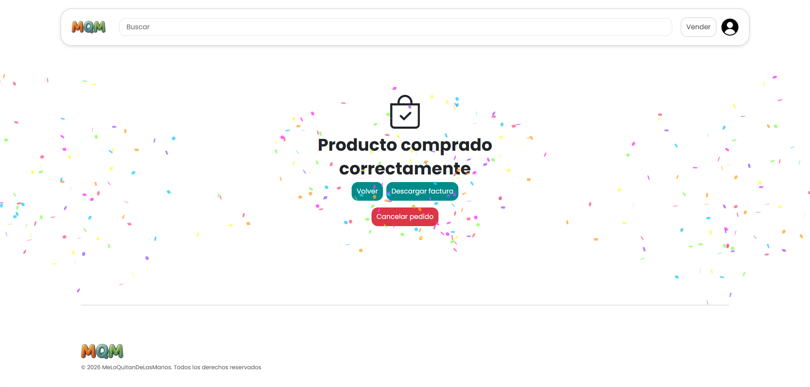
> Page shown to the user after a successful purchase. It includes buttons to download invoice or cancel order.


#### **Navigation Diagram**

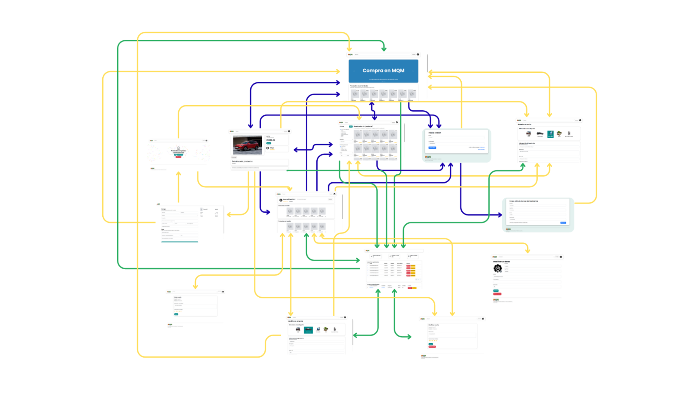

> The blue arrows represent actions that all users can make, the yellow arrows are only for registered users and the green arrows are for administrators.

### **Executing Instructions**

#### **Prerequisites for executing the application**

- **Java**: version 21 or higher
- **Maven**: version 3.8 or higher
- **MySQL**: version 8.0 or higher (in the following steps we will use Docker image)
- **Git**: for cloning the repository

#### **Steps for executing the application**

1. **Clone the repository**

```bash
git clone https://github.com/CodeURJC-SSDD-2025-26/practica-ssdd-2025-26-grupo-13.git
cd practica-ssdd-2025-26-grupo-13
```
2. **Create application-dev.properties in resources folder**. The following variables will be needed:
```
google.maps.api-key=<FILL HERE>
spring.mail.password=<FILL HERE>
spring.mail.username=<FILL HERE>
```
IMPORTANT! The app will **not** work properly without Google Maps Places API (New) key: an error will appear while trying to register, although it's still possible to test the app with the credentials listed below. If Spring Mail variables are not filled, app will keep working as usual but no emails will be sent. 

3. **Run MySQL database with Docker**
```
docker run --name mqmdb --rm -e MYSQL_ROOT_PASSWORD=mqmurjc -e MYSQL_DATABASE=mqm -p 3306:3306 -d mysql:latest
```
Other alternatives for running MySQL are possible, but credentials should be `root:mqmurjc` and database `mqm`. 

4. **Compile and execute the app**
```
cd backend
mvn clean install
mvn spring-boot:run
```
The application will be available at `https://localhost:8443`.

#### **Test credentials**

- **Admin user**: user: `admin@admin.com`, password: `1234`
- **Registered user**: user: `usuario1@example.com`, password: `1234`, user:`usuario2@example.com`, password:`1234`

### **Database Entity Diagram**

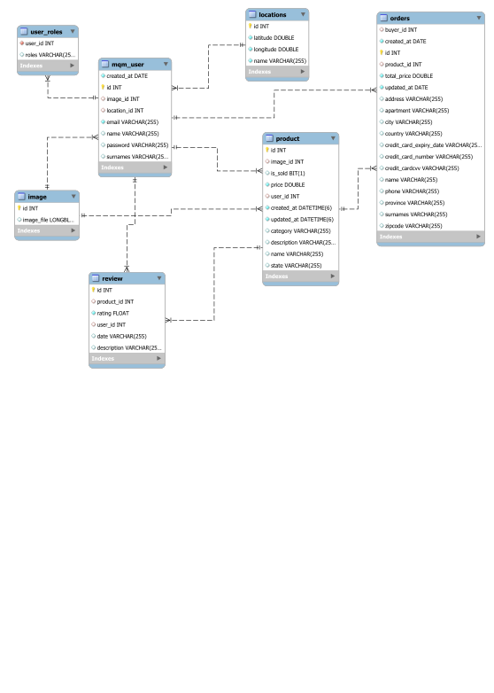


### **Classes and Templates Diagram**

Application's Classes Diagram diferentiating by colors or sections:

```mermaid 
flowchart LR
  %% Left -> Right: Templates -> View -> Controller -> Service -> Repository -> Entity

  %% ===== LEFT SIDE (templates + view + controller) =====
  T_idx["index.html"]:::templateTxt --> V_idx["View"]:::view --> C_idx["IndexController"]:::controller
  T_search["search.html"]:::templateTxt --> V_search["View"]:::view --> C_search["SearchController"]:::controller
  T_product["product.html<br/>sell_product.html<br/>modify_product.html"]:::templateTxt --> V_product["View"]:::view --> C_product["ProductController"]:::controller
  T_buy["buy.html<br/>order_successful.html"]:::templateTxt --> V_buy["View"]:::view --> C_buy["BuyController"]:::controller
  T_review["create_review.html<br/>modify_review.html"]:::templateTxt --> V_review["View"]:::view --> C_review["ReviewController"]:::controller
  T_profile["user_profile.html"]:::templateTxt --> V_profile["View"]:::view --> C_profile["UserProfileController"]:::controller
  T_account["register.html<br/>login.html<br/>administrator_login.html<br/>modify_user.html"]:::templateTxt --> V_account["View"]:::view --> C_account["AccountController"]:::controller
  T_admin["administrator_dashboard.html"]:::templateTxt --> V_admin["View"]:::view --> C_admin["AdministratorDashboardController"]:::controller
  T_misc["error.html<br/>example.html"]:::templateTxt --> V_misc["View"]:::view --> C_misc["ErrorPageController"]:::controller
  C_image["ImageController"]:::controller
  %% ===== SERVICES =====
  S_product["ProductService"]:::service
  S_user["UserService"]:::service
  S_review["ReviewService"]:::service
  S_order["OrderService"]:::service
  S_image["ImageService"]:::service
  S_location["LocationService"]:::service
  S_mail["MailService"]:::service
  S_ticket["TicketService"]:::service

  %% Controller -> Service
  C_idx --> S_product
  C_idx --> S_review

  C_search --> S_product

  C_product --> S_product
  C_product --> S_user
  C_product --> S_review
  C_product --> S_image

  C_buy --> S_product
  C_buy --> S_order
  C_buy --> S_mail
  C_buy --> S_ticket

  C_review --> S_review
  C_review --> S_product
  C_review --> S_order

  C_profile --> S_user
  C_profile --> S_order
  C_profile --> S_product
  C_profile --> S_review

  C_account --> S_user
  C_account --> S_image
  C_account --> S_location

  C_admin --> S_user
  C_admin --> S_product
  C_admin --> S_review
  C_admin --> S_order
  
  C_image --> S_image


  %% ===== REPOSITORIES =====
  R_product["ProductRepository"]:::repo
  R_user["UserRepository"]:::repo
  R_review["ReviewRepository"]:::repo
  R_order["OrderRepository"]:::repo
  R_image["ImageRepository"]:::repo
  R_location["LocationRepository"]:::repo

  %% Service -> Repository
  S_product --> R_product
  S_product --> R_user
  S_user --> R_user
  S_review --> R_review
  S_order --> R_order
  S_image --> R_image
  S_location --> R_location

  %% ===== ENTITIES =====
  E_product["Product"]:::entity
  E_user["User"]:::entity
  E_review["Review"]:::entity
  E_order["Order"]:::entity
  E_image["Image"]:::entity
  E_location["Location"]:::entity

  %% Repository -> Entity
  R_product --> E_product
  R_user --> E_user
  R_review --> E_review
  R_order --> E_order
  R_image --> E_image
  R_location --> E_location

  %% Main entity relations (optional, like in your sample)
  E_product --> E_user
  E_product --> E_image
  E_user --> E_image
  E_user --> E_location
  E_review --> E_product
  E_review --> E_user
  E_order --> E_product
  E_order --> E_user

  %% ===== STYLES (close to sample palette) =====
  classDef templateTxt fill:transparent,stroke:transparent,color:#b06fa2;
  classDef view fill:#d9c6e6,stroke:#8d6aa8,color:#2e1d36,stroke-width:1px;
  classDef controller fill:#cfe8c6,stroke:#79a56a,color:#1f3a17,stroke-width:1px;
  classDef service fill:#f1c9c9,stroke:#b06a6a,color:#4a1f1f,stroke-width:1px;
  classDef repo fill:#cfe0f5,stroke:#6d8fb1,color:#1f3550,stroke-width:1px;
  classDef entity fill:#ececec,stroke:#8b8b8b,color:#2b2b2b,stroke-width:1px;
  ```


### **Members Participation in Assignment 2**

#### **Student 1 - Diego Rodríguez Torrecilla**

Built index and search pages (templates, controllers, and their database integration). Implemented dynamic search with filters and pagination, querying the database with CriteriaBuilder for optional filter combinations. Took part in the User and Product implementation, including their entities, repositories, and services. Developed the distance mechanism in the application: usage of Google Maps API during registration to get user location, storing coordinates in the Location entity, and finally using the Haversine formula for showing distances and sorting search results by them. Implemented a significant part of Spring Security, including SecurityFilterChain, UserDetailsService, and multiple access-control checks with @PreAuthorize for entity update and delete operations. Developed the purchase flow with the Order entity and buy page, validating shipping form data in both the frontend (Bootstrap) and backend (Spring + regular expressions). Designed the advanced algorithm for product recommendations on the index page, with a scoring system based on distance and categories from recently purchased products (using ExtendedProduct to store this extra user-dependent data). Added automated purchase confirmation emails for both buyer and seller using Spring Mail.

| Nº  |                                                                                                   Commits                                                                                                    |                                                                                                                                                                                                                                                                                                                            Files                                                                                                                                                                                                                                                                                                                            |
| :-: | :----------------------------------------------------------------------------------------------------------------------------------------------------------------------------------------------------------: | :---------------------------------------------------------------------------------------------------------------------------------------------------------------------------------------------------------------------------------------------------------------------------------------------------------------------------------------------------------------------------------------------------------------------------------------------------------------------------------------------------------------------------------------------------------------------------------------------------------------------------------------------------------: |
|  1  |           [Implement Spring Security for user authentication and add related services and configurations](https://github.com/CodeURJC-SSDD-2025-26/practica-ssdd-2025-26-grupo-13/commit/87aa410)            | Mostly [backend/src/main/java/es/mqm/webapp/SecurityConfiguration.java](https://github.com/CodeURJC-SSDD-2025-26/practica-ssdd-2025-26-grupo-13/blob/main/backend/src/main/java/es/mqm/webapp/SecurityConfiguration.java), [backend/src/main/java/es/mqm/webapp/service/RepositoryUserDetailsService.java](https://github.com/CodeURJC-SSDD-2025-26/practica-ssdd-2025-26-grupo-13/blob/main/backend/src/main/java/es/mqm/webapp/service/RepositoryUserDetailsService.java), [backend/src/main/resources/templates/login.html](https://github.com/CodeURJC-SSDD-2025-26/practica-ssdd-2025-26-grupo-13/blob/main/backend/src/main/resources/templates/login.html) |
|  2  |                        [Implement recommendation algorithm based on distance and categories](https://github.com/CodeURJC-SSDD-2025-26/practica-ssdd-2025-26-grupo-13/commit/782be4d)                         |                   Mostly [backend/src/main/java/es/mqm/webapp/service/GeoUtils.java](https://github.com/CodeURJC-SSDD-2025-26/practica-ssdd-2025-26-grupo-13/blob/main/backend/src/main/java/es/mqm/webapp/service/GeoUtils.java), [backend/src/main/java/es/mqm/webapp/service/ProductService.java](https://github.com/CodeURJC-SSDD-2025-26/practica-ssdd-2025-26-grupo-13/blob/main/backend/src/main/java/es/mqm/webapp/service/ProductService.java), [backend/src/main/resources/templates/search.html](https://github.com/CodeURJC-SSDD-2025-26/practica-ssdd-2025-26-grupo-13/blob/main/backend/src/main/resources/templates/search.html)                   |
|  3  | [Implement Location entity and integrate Google Maps Autocomplete API for user registration and location management](https://github.com/CodeURJC-SSDD-2025-26/practica-ssdd-2025-26-grupo-13/commit/a94ca20) |                  Mostly [backend/src/main/java/es/mqm/webapp/model/Location.java](https://github.com/CodeURJC-SSDD-2025-26/practica-ssdd-2025-26-grupo-13/blob/main/backend/src/main/java/es/mqm/webapp/model/Location.java), [backend/src/main/java/es/mqm/webapp/service/LocationService.java](https://github.com/CodeURJC-SSDD-2025-26/practica-ssdd-2025-26-grupo-13/blob/main/backend/src/main/java/es/mqm/webapp/service/LocationService.java), [backend/src/main/resources/templates/register.html](https://github.com/CodeURJC-SSDD-2025-26/practica-ssdd-2025-26-grupo-13/blob/main/backend/src/main/resources/templates/register.html)                  |
|  4  |          [Implement complete filter functionality in /search. Modify /buy to get information from database](https://github.com/CodeURJC-SSDD-2025-26/practica-ssdd-2025-26-grupo-13/commit/345353d)          |      Mostly [backend/src/main/java/es/mqm/webapp/controller/SearchController.java](https://github.com/CodeURJC-SSDD-2025-26/practica-ssdd-2025-26-grupo-13/blob/main/backend/src/main/java/es/mqm/webapp/controller/SearchController.java), [backend/src/main/java/es/mqm/webapp/controller/BuyController.java](https://github.com/CodeURJC-SSDD-2025-26/practica-ssdd-2025-26-grupo-13/blob/main/backend/src/main/java/es/mqm/webapp/controller/BuyController.java), [backend/src/main/resources/templates/search.html](https://github.com/CodeURJC-SSDD-2025-26/practica-ssdd-2025-26-grupo-13/blob/main/backend/src/main/resources/templates/search.html)      |
|  5  |                    [Add email notification system for order confirmations to buyers and sellers](https://github.com/CodeURJC-SSDD-2025-26/practica-ssdd-2025-26-grupo-13/commit/c5711ee)                     |                 Mostly [backend/src/main/java/es/mqm/webapp/service/MailService.java](https://github.com/CodeURJC-SSDD-2025-26/practica-ssdd-2025-26-grupo-13/blob/main/backend/src/main/java/es/mqm/webapp/service/MailService.java), [backend/src/main/resources/templates/orderemail.html](https://github.com/CodeURJC-SSDD-2025-26/practica-ssdd-2025-26-grupo-13/blob/main/backend/src/main/resources/templates/orderemail.html), [backend/src/main/resources/templates/ordervendoremail.html](https://github.com/CodeURJC-SSDD-2025-26/practica-ssdd-2025-26-grupo-13/blob/main/backend/src/main/resources/templates/ordervendoremail.html)                 |

---

#### **Student 2 - Lucía López García del Pino**

First, I addapted the old templates to the new Spring project, creating the respective controllers. Then, I created an Image entity, service and repository and made all the changes necessary in services and entities for the uploading and downloading of user and product images so that images are in the database and they show in the respective products or users. I also made the web's error page and rerouted errors as well as handling the paginations of different pages such as user_profile and admin_dashboard. Lastly, I controlled the access to restricted pages like modify_review. Other important additions that aren't in the main commits are creating the order ticket and controlling access to document so that the only users with access are the admin and the user that made said order, and using the database information for the admin's charts and information. In addition, I also made some final changes to show stars correctly, take the category from the form and display when a product has already been bought (since it cannot be bought again) as well as making some queries to the database to modify or delete elements.

| Nº    | Commits      | Files      |
|:------------: |:------------:| :------------:|
|  1  | [Creation of modify product and sell product, admin and user profile pages, controllers and css files](https://github.com/CodeURJC-SSDD-2025-26/practica-ssdd-2025-26-grupo-13/commit/606a893e) | Mostly[user_profile.html](https://github.com/CodeURJC-SSDD-2025-26/practica-ssdd-2025-26-grupo-13/blob/main/backend/src/main/resources/templates/user_profile.html),[administrator_dashboard.html](https://github.com/CodeURJC-SSDD-2025-26/practica-ssdd-2025-26-grupo-13/blob/main/backend/src/main/resources/templates/administrator_dashboard.html), [user_profile.css](https://github.com/CodeURJC-SSDD-2025-26/practica-ssdd-2025-26-grupo-13/blob/main/backend/src/main/resources/static/css/user_profile.css) |
|  2  | [Changing user and product photos so that they are in the database, and adding an image entity](https://github.com/CodeURJC-SSDD-2025-26/practica-ssdd-2025-26-grupo-13/commit/171ec796) | Mostly [ImageService.java](https://github.com/CodeURJC-SSDD-2025-26/practica-ssdd-2025-26-grupo-13/blob/main/backend/src/main/java/es/mqm/webapp/service/ImageService.java),[Image.java](https://github.com/CodeURJC-SSDD-2025-26/practica-ssdd-2025-26-grupo-13/blob/main/backend/src/main/java/es/mqm/webapp/model/Image.java) |
|  3  | [Creation of a functional error page and changes in product structure in all pages related](https://github.com/CodeURJC-SSDD-2025-26/practica-ssdd-2025-26-grupo-13/commit/bb01902) | Mostly [AccountController.java](https://github.com/CodeURJC-SSDD-2025-26/practica-ssdd-2025-26-grupo-13/blob/main/backend/src/main/java/es/mqm/webapp/controller/AccountController.java), [ErrorPageController.java](https://github.com/CodeURJC-SSDD-2025-26/practica-ssdd-2025-26-grupo-13/blob/main/backend/src/main/java/es/mqm/webapp/controller/ErrorPageController.java) |
|  4  | [Pagination in admin_dashboard and getting users, products and reviews from the database](https://github.com/CodeURJC-SSDD-2025-26/practica-ssdd-2025-26-grupo-13/commit/1993234c) | Mostly [AdministratorDashboardController.java](https://github.com/CodeURJC-SSDD-2025-26/practica-ssdd-2025-26-grupo-13/blob/main/backend/src/main/java/es/mqm/webapp/controller/AdministratorDashboardController.java), [administrator_dashboard.html](https://github.com/CodeURJC-SSDD-2025-26/practica-ssdd-2025-26-grupo-13/blob/main/backend/src/main/resources/templates/administrator_dashboard.html) |
|  5  | [Ensuring that only authorized users access to the pages and not being able to buy sold products](https://github.com/CodeURJC-SSDD-2025-26/practica-ssdd-2025-26-grupo-13/commit/91e084d1) | Mostly [ReviewService.java](https://github.com/CodeURJC-SSDD-2025-26/practica-ssdd-2025-26-grupo-13/blob/main/backend/src/main/java/es/mqm/webapp/service/ReviewService.java), [OrderService.java](https://github.com/CodeURJC-SSDD-2025-26/practica-ssdd-2025-26-grupo-13/blob/main/backend/src/main/java/es/mqm/webapp/service/OrderService.java), [administrator_dashboard.html](https://github.com/CodeURJC-SSDD-2025-26/practica-ssdd-2025-26-grupo-13/blob/main/backend/src/main/resources/templates/administrator_dashboard.html) |

---

#### **Student 3 - Lucas Moreno Prieto**

First, I took charge of the product page, extracting information from the database and adding pagination to the reviews. Another major contribution was everything related to reviews: the "create_review" and "modify_review" pages, and all the review-related features on the other pages. In addition, I implemented the star rating system, applying the changes to all pages where it appears. I also managed the "modify_user" page. Furthermore, I added CSRF, and finally, it's worth noting that we've all been modifying most of the pages to varying degrees.

| Nº    | Commits      | Files      |
|:------------: |:------------:| :------------:|
|1| [add protection with CSRF](https://github.com/CodeURJC-SSDD-2025-26/practica-ssdd-2025-26-grupo-13/commit/5268caac0fcc2133e3a95e0aec4ee803882e0143)  | [CSRFHandlerConfiguration.java](https://github.com/CodeURJC-SSDD-2025-26/practica-ssdd-2025-26-grupo-13/blob/main/backend/src/main/java/es/mqm/webapp/CSRFHandlerConfiguration.java)   |
|2| [Added modify user and review templates, implemented Product and Review controllers, updated create review form action and updated user profile layout and functionality](https://github.com/CodeURJC-SSDD-2025-26/practica-ssdd-2025-26-grupo-13/commit/03662f0ae6b06fc2eac62b112a9190cb587e51f0)  | [ProductController.java](https://github.com/CodeURJC-SSDD-2025-26/practica-ssdd-2025-26-grupo-13/blob/main/backend/src/main/java/es/mqm/webapp/controller/ProductController.java), [ReviewController.java](https://github.com/CodeURJC-SSDD-2025-26/practica-ssdd-2025-26-grupo-13/blob/main/backend/src/main/java/es/mqm/webapp/controller/ReviewController.java)   |
|3| [Refactor Review handling, introduce ReviewService for better management and solve minor errors](https://github.com/CodeURJC-SSDD-2025-26/practica-ssdd-2025-26-grupo-13/commit/07908f1f8938fbb436f20599b5c52928f10f3f0c)  | [ReviewService.java](https://github.com/CodeURJC-SSDD-2025-26/practica-ssdd-2025-26-grupo-13/blob/main/backend/src/main/java/es/mqm/webapp/service/ReviewService.java), [ReviewController.java](https://github.com/CodeURJC-SSDD-2025-26/practica-ssdd-2025-26-grupo-13/blob/main/backend/src/main/java/es/mqm/webapp/controller/ReviewController.java) |
|4| [Properly develop the product templete and the ProductController](https://github.com/CodeURJC-SSDD-2025-26/practica-ssdd-2025-26-grupo-13/commit/8561643b434dd2f66c63515e117ef242e24afe88)  | [ProductController.java](https://github.com/CodeURJC-SSDD-2025-26/practica-ssdd-2025-26-grupo-13/blob/main/backend/src/main/java/es/mqm/webapp/controller/ProductController.java), [product.html](https://github.com/CodeURJC-SSDD-2025-26/practica-ssdd-2025-26-grupo-13/blob/main/backend/src/main/resources/templates/product.html)  |
|5| [solve a problem with the reviews, create the order_successful page, and add small details on other pages](https://github.com/CodeURJC-SSDD-2025-26/practica-ssdd-2025-26-grupo-13/commit/cdfbbc18c53eac1fb94cae8a12f48579d2655998)  | [order_successful.html](https://github.com/CodeURJC-SSDD-2025-26/practica-ssdd-2025-26-grupo-13/blob/main/backend/src/main/resources/templates/order_successful.html), [BuyController.java](https://github.com/CodeURJC-SSDD-2025-26/practica-ssdd-2025-26-grupo-13/blob/main/backend/src/main/java/es/mqm/webapp/controller/BuyController.java)|

---


## 🛠 **Práctica 3: API REST, docker y despliegue**

### **Documentación de la API REST**

#### **Especificación OpenAPI**

📄 **[Especificación OpenAPI (YAML)](/api-docs/api-docs.yaml)**

#### **Documentación HTML**

📖 **[Documentación API REST (HTML)](https://raw.githack.com/[usuario]/[repositorio]/main/api-docs/api-docs.html)**

> La documentación de la API REST se encuentra en la carpeta `/api-docs` del repositorio. Se ha generado automáticamente con SpringDoc a partir de las anotaciones en el código Java.

### **Diagrama de Clases y Templates Actualizado**

Diagrama actualizado incluyendo los @RestController y su relación con los @Service compartidos:


### **Instrucciones de Ejecución con Docker**

#### **Requisitos previos:**

- Docker instalado (versión 20.10 o superior)
- Docker Compose instalado (versión 2.0 o superior)

#### **Pasos para ejecutar con docker-compose:**

1. **Clonar el repositorio** (si no lo has hecho ya):

   ```bash
   git clone https://github.com/[usuario]/[repositorio].git
   cd [repositorio]
   ```

2. **AQUÍ LOS SIGUIENTES PASOS**:

### **Construcción de la Imagen Docker**

#### **Requisitos:**

- Docker instalado en el sistema

#### **Pasos para construir y publicar la imagen:**

1. **Navegar al directorio de Docker**:

   ```bash
   cd docker
   ```

2. **AQUÍ LOS SIGUIENTES PASOS**

### **Despliegue en Máquina Virtual**

#### **Requisitos:**

- Acceso a la máquina virtual (SSH)
- Clave privada para autenticación
- Conexión a la red correspondiente o VPN configurada

#### **Pasos para desplegar:**

1. **Conectar a la máquina virtual**:

   ```bash
   ssh -i [ruta/a/clave.key] [usuario]@[IP-o-dominio-VM]
   ```

   Ejemplo:

   ```bash
   ssh -i ssh-keys/app.key vmuser@10.100.139.XXX
   ```

2. **AQUÍ LOS SIGUIENTES PASOS**:

### **URL de la Aplicación Desplegada**

🌐 **URL de acceso**: `https://[nombre-app].etsii.urjc.es:8443`

#### **Credenciales de Usuarios de Ejemplo**

| Rol                | Usuario | Contraseña |
| :----------------- | :------ | :--------- |
| Administrador      | admin   | admin123   |
| Usuario Registrado | user1   | user123    |
| Usuario Registrado | user2   | user123    |

### **OTRA DOCUMENTACIÓN ADICIONAL REQUERIDA EN LA PRÁCTICA**

### **Participación de Miembros en la Práctica 3**

#### **Alumno 1 - [Nombre Completo]**

[Descripción de las tareas y responsabilidades principales del alumno en el proyecto]

| Nº  |               Commits                |           Files           |
| :-: | :----------------------------------: | :-----------------------: |
|  1  | [Descripción commit 1](URL_commit_1) | [Archivo1](URL_archivo_1) |
|  2  | [Descripción commit 2](URL_commit_2) | [Archivo2](URL_archivo_2) |
|  3  | [Descripción commit 3](URL_commit_3) | [Archivo3](URL_archivo_3) |
|  4  | [Descripción commit 4](URL_commit_4) | [Archivo4](URL_archivo_4) |
|  5  | [Descripción commit 5](URL_commit_5) | [Archivo5](URL_archivo_5) |

---

#### **Alumno 2 - [Nombre Completo]**

[Descripción de las tareas y responsabilidades principales del alumno en el proyecto]

| Nº  |               Commits                |           Files           |
| :-: | :----------------------------------: | :-----------------------: |
|  1  | [Descripción commit 1](URL_commit_1) | [Archivo1](URL_archivo_1) |
|  2  | [Descripción commit 2](URL_commit_2) | [Archivo2](URL_archivo_2) |
|  3  | [Descripción commit 3](URL_commit_3) | [Archivo3](URL_archivo_3) |
|  4  | [Descripción commit 4](URL_commit_4) | [Archivo4](URL_archivo_4) |
|  5  | [Descripción commit 5](URL_commit_5) | [Archivo5](URL_archivo_5) |

---

#### **Alumno 3 - [Nombre Completo]**

[Descripción de las tareas y responsabilidades principales del alumno en el proyecto]

| Nº  |               Commits                |           Files           |
| :-: | :----------------------------------: | :-----------------------: |
|  1  | [Descripción commit 1](URL_commit_1) | [Archivo1](URL_archivo_1) |
|  2  | [Descripción commit 2](URL_commit_2) | [Archivo2](URL_archivo_2) |
|  3  | [Descripción commit 3](URL_commit_3) | [Archivo3](URL_archivo_3) |
|  4  | [Descripción commit 4](URL_commit_4) | [Archivo4](URL_archivo_4) |
|  5  | [Descripción commit 5](URL_commit_5) | [Archivo5](URL_archivo_5) |

---

#### **Alumno 4 - [Nombre Completo]**

[Descripción de las tareas y responsabilidades principales del alumno en el proyecto]

| Nº  |               Commits                |           Files           |
| :-: | :----------------------------------: | :-----------------------: |
|  1  | [Descripción commit 1](URL_commit_1) | [Archivo1](URL_archivo_1) |
|  2  | [Descripción commit 2](URL_commit_2) | [Archivo2](URL_archivo_2) |
|  3  | [Descripción commit 3](URL_commit_3) | [Archivo3](URL_archivo_3) |
|  4  | [Descripción commit 4](URL_commit_4) | [Archivo4](URL_archivo_4) |
|  5  | [Descripción commit 5](URL_commit_5) | [Archivo5](URL_archivo_5) |

---


